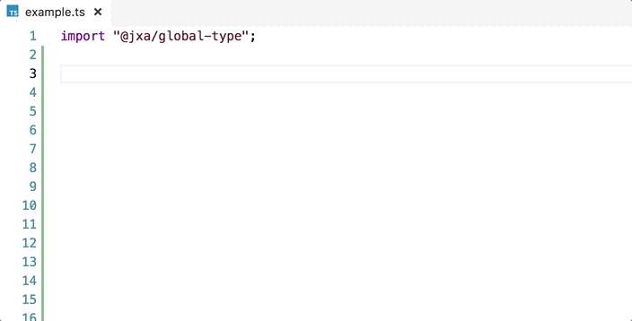

# @jxa/global-type

JXA typing for global.

This typing enable auto-complete in your editor.



- [TypeScript Editor Support · Microsoft/TypeScript Wiki](https://github.com/Microsoft/TypeScript/wiki/TypeScript-Editor-Support)

## Install

Install with [npm](https://www.npmjs.com/):

    npm install @jxa/global-type

## Usage

Install and includes `@jxa/global-type` as typing.
Then, automatically inject `Application` to `global`

### via `import("@jxa/global-type")`

You can add JSX types to `global` by import `@jxa/global-type`:

```ts
import "@jxa/global-type";

// your JXA application
var userName = Application("System Events").currentUser().name();
```

### via tsconfig.json

- [ ] welcome PR

### Via reference comment

```ts
/// <reference path="./node_modules/@jxa/global-type/src/index.d.ts" />

// your JXA application
var userName = Application("System Events").currentUser().name();
```

## Changelog

See [Releases page](https://github.com/JXA-userland/JXA/releases).

## Running tests

    yarn test

## Contributing

Pull requests and stars are always welcome.

For bugs and feature requests, [please create an issue](https://github.com/JXA-userland/JXA/issues).

1. Fork it!
2. Create your feature branch: `git checkout -b my-new-feature`
3. Commit your changes: `git commit -am 'Add some feature'`
4. Push to the branch: `git push origin my-new-feature`
5. Submit a pull request :D

## Author

- [github/azu](https://github.com/azu)
- [twitter/azu_re](https://twitter.com/azu_re)

## License

MIT © azu
